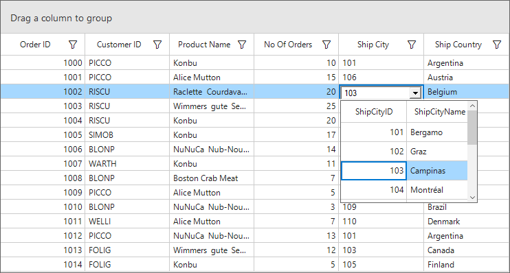

# How to create DropDown DataGrid column in WinForms DataGrid (SfDataGrid)?

## About the sample

This example illustrates how to create DropDown DataGrid column in WinForms DataGrid.

[WinForms DataGrid](https://www.syncfusion.com/winforms-ui-controls/datagrid) (SfDataGrid) allows you to show another SfDataGrid in a dropdown of a column by creating a custom column using [ComboDropDown](https://www.syncfusion.com/winforms-ui-controls/combodropdown) control as edit element.

```C#

public Form1()
{
    InitializeComponent();

    sfDataGrid.CellRenderers.Add("DropDownDataGrid", new GridDropDownDataGridCellRenderer(this.sfDataGrid));

    sfDataGrid.Columns.Add(new GridDropDownDataGridColumn() { MappingName = "ShipCityID", HeaderText = "Ship City", DataSource = new CountryInfoRepository().Cities });
}

public class GridDropDownDataGridColumn : GridColumn
{

    public GridDropDownDataGridColumn()
    {
        SetCellType("DropDownDataGrid");
    }

    public IEnumerable DataSource { get; set; }
}

public class GridDropDownDataGridCellRenderer : GridVirtualizingCellRendererBase<ComboDropDown>
{
    SfDataGrid DataGrid { get; set; }
    public GridDropDownDataGridCellRenderer(SfDataGrid dataGrid)
    {
        DataGrid = dataGrid;
    }
    protected override void OnRender(Graphics paint, Rectangle cellRect, string cellValue, CellStyleInfo style, DataColumnBase column, RowColumnIndex rowColumnIndex)
    {
        base.OnRender(paint, cellRect, cellValue, style, column, rowColumnIndex);
    }

    

    protected override void OnInitializeEditElement(DataColumnBase column, RowColumnIndex rowColumnIndex, ComboDropDown uiElement)
    {
        Rectangle editorRectangle = GetEditorUIElementBounds();
        uiElement.Size = editorRectangle.Size;
        uiElement.Location = editorRectangle.Location;
        uiElement.DropDownWidth = 300;

        SfDataGrid dropDownDataGrid = new SfDataGrid()
        {
            DataSource = (column.GridColumn as GridDropDownDataGridColumn).DataSource,
        };

        uiElement.PopupControl = dropDownDataGrid;
        uiElement.DropDownStyle = ComboBoxStyle.DropDownList;

        this.TableControl.Controls.Add(uiElement);
        uiElement.Focus();

        base.OnInitializeEditElement(column, rowColumnIndex, uiElement);

        dropDownDataGrid.SelectionChanged += DropDownDataGrid_SelectionChanged;


    }

    private void DropDownDataGrid_SelectionChanged(object sender, SelectionChangedEventArgs e)
    {
        this.DataGrid.View.GetPropertyAccessProvider().SetValue(this.DataGrid.SelectedItem, this.DataGrid.CurrentCell.Column.MappingName, (e.AddedItems[0] as ShipCityDetails).ShipCityID);
        (this.DataGrid.CurrentCell.CellRenderer.CurrentCellRendererElement as ComboDropDown).Text = (e.AddedItems[0] as ShipCityDetails).ShipCityID.ToString();
        (this.DataGrid.CurrentCell.CellRenderer.CurrentCellRendererElement as ComboDropDown).DroppedDown = false;
    }
}

```



## Requirements to run the demo 

Visual Studio 2015 and above versions.
